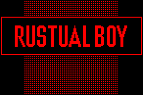
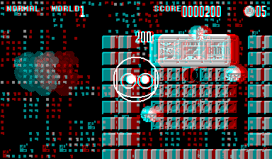
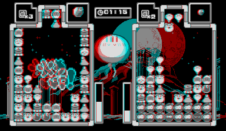
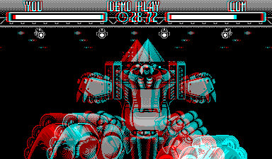

# Rustual Boy    

## Description

Rustual Boy is a [Virtual Boy](https://en.wikipedia.org/wiki/Virtual_Boy) emulator. It can be used to play existing Virtual Boy games, as well as be a helpful development/debugging tool for homebrew for this platform.

The name "Rustual Boy" is a [portmanteau](https://en.wikipedia.org/wiki/Portmanteau) of the words "Rust" and "Virtual Boy". Ok, the "Virtual Boy" part was obvious, but why "Rust"? In fact, Rustual Boy is written in the [Rust programming language](https://www.rust-lang.org/en-US/) - a "systems programming language that runs blazingly fast, prevents segfaults, and guarantees thread safety." Rust is a wonderful language with a thriving community, and as such provides a fantastic platform for an emulation project!

## Status

Rustual Boy is currently able to emulate [the majority of commercial Virtual Boy titles](https://github.com/emu-rs/rustual-boy#known-game-compatibility), as well as many homebrew ones as well. It supports basic video/audio output and keyboard input, as well as a simple CLI debugger.

While Rustual Boy's core emulation is nearly complete [compatibility-wise](https://github.com/emu-rs/rustual-boy#known-game-compatibility), the project is still quite young, and needs some time to mature. Particularly, there are currently no binary distributions (only source), its user interface is lacking (read: virtually non-existent), and there are some known (and probably unknown) stability/compatibility issues. Also, performance isn't fantastic yet, but the emulator should be playable at least.

That said, these things are bound to improve with time, and everyone is encouraged to [build the emulator](https://github.com/emu-rs/rustual-boy#building-and-running), give it a shot, and [report any bugs/feature requests](CONTRIBUTING.md)!

## Screenshots

## Known game compatibility

| Game | USA | JP | Notes |
| --- | --- | --- | --- |
| 3-D Tetris | | N/A | Uses bit string ops |
| Bound High! | x | N/A | ROM is both USA+JP |
| Galactic Pinball | x | x | |
| Golf | | | Uses bit string ops |
| Insmouse No Yakata | N/A | x | |
| Jack Bros. | x | x | |
| Mario Clash | x | x | |
| Mario's Tennis | x | x | |
| Nester's Funky Bowling | | N/A | Uses bit string ops |
| Panic Bomber | x | x | |
| Red Alarm | | | Uses bit string ops |
| SD Gundam Dimension War | N/A | x | |
| Space Invaders Virtual Collection | N/A | | Lazers aren't visible on most of the screen in "Virtual 3D" mode |
| Space Squash | N/A | | Game doesn't start; seems to be waiting on an interrupt (see commits [7423524](https://github.com/emu-rs/rustual-boy/commit/74235249a1abfca8d4b3d80e8c3c6b37230679a2) and [0ff9c61](https://github.com/emu-rs/rustual-boy/commit/0ff9c61efb188832680292a11c1a24c5c4f25360) for some investigation) |
| Teleroboxer | x | x | |
| V-Tetris | N/A | x | |
| Vertical Force | | | Enemies/powerups appear/disappear, first boss disappears and the game softlocks |
| Virtual Bowling | N/A | | Some graphical glitches and slowdowns in the intro sequence, possibly other bugs |
| Virtual Boy Wario Land | x | x | |
| Virtual Fishing | N/A | x | |
| Virtual Lab | N/A | x | |
| Virtual League Baseball | x | x | |
| Waterworld | x | N/A | |

## Building and running

Currently, the only dependency for building is Rust itself, which can be downloaded [here](https://www.rust-lang.org/downloads.html). Once that's installed, you can clone the repo, and simply `cargo build`/`cargo run` your way to victory! It's recommended to use the `--release` flag as well, as emulation can require a lot of CPU power, so we'll want all the compiler help we can get.

If you're new to using Cargo (Rust's build system), it's recommended to give the [Cargo Guide](http://doc.crates.io/guide.html) a quick skim.

## Contributing

Rustual Boy aims to be an open project where anyone can contribute. If you're interested, check [CONTRIBUTING.md](CONTRIBUTING.md)!

## License

Licensed under either of

 * Apache License, Version 2.0, ([LICENSE-APACHE](LICENSE-APACHE) or http://www.apache.org/licenses/LICENSE-2.0)
 * MIT license ([LICENSE-MIT](LICENSE-MIT) or http://opensource.org/licenses/MIT)

at your option.
